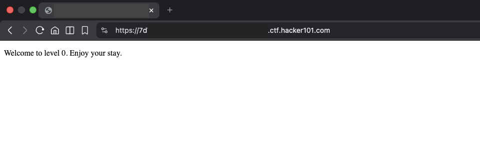
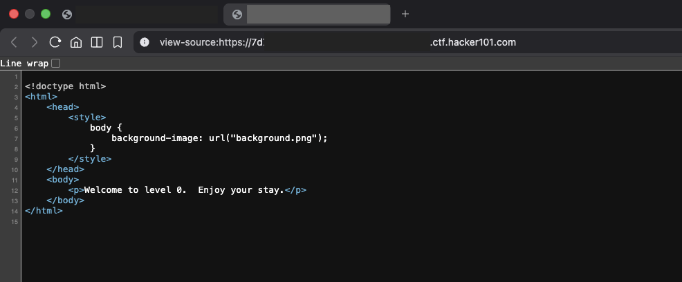
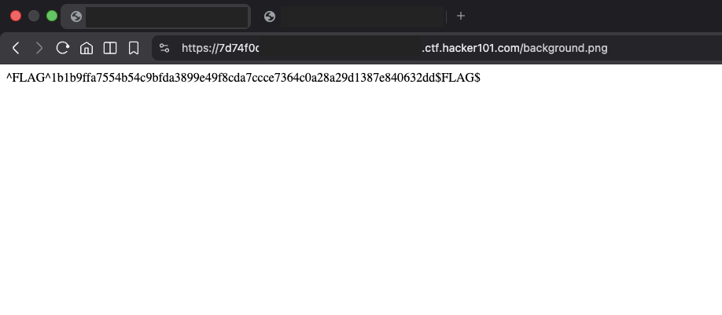

# A little something to get you started - FLAG0

## Step 1 Inspect the Page



## Step 2 Access Developer Tools or View Source

After careful reading we notice that there's a background image hidden in the page



```html
<style>
	body {
		background-image: url("background.png");
	}
</style>
```

## Step 3 Follow the path

add a /background.png after the URL

```html
http:// url.ctf.hacker101.com/background.png
```



## Step 4 Submit the Flag
